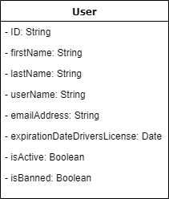

# User Service

## Funktionsbeschreibung

Dieser Service ist für die Verwaltung der Accounts zuständig. Dafür bietet er folgende Funktionen für Accounts:
- Erstellen
- Löschen
- Ändern
- Freigeben / Sperren
- Bereitstellen (GET)
- Inaktiv setzen

## Schnittstellen

Befindet sich in der Subdomäne *Stammdaten-Verwaltung* und kommuniziert mit der Subdomäne *Business-Logik*.

**#TODO: Welche Schnittstellen sollen beschrieben werden??**
- zwischen den Services
- zu Nutzergruppen (Kunde, Mitarbeiter, Admin, ...)
- REST Schnittstelle?

## Datenmodell

